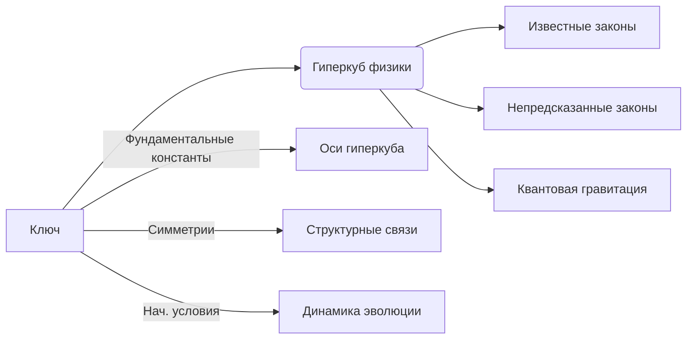

### Прогнозирование физических законов через гиперкуб: эпистемологический анализ

**Ключевая идея**: Если представить все физические законы как структурированный гиперкуб, то знание его "ключа" действительно позволило бы предсказывать неизвестные законы. Но здесь возникают фундаментальные вопросы:

---

#### 1. **Что является "ключом" в физическом гиперкубе?**
- **Фундаментальные константы**:
  ```math
  \alpha = \frac{e^2}{4\pi\epsilon_0\hbar c} \approx \frac{1}{137}
  ```
  Комбинация констант (c, ħ, G, e) образует "базисный ключ" мироздания.

- **Симметрийные принципы**:
  - Лоренц-инвариантность
  - Калибровочная инвариантность
  - CPT-симметрия

- **Начальные условия Вселенной**:
  - Энтропия Большого взрыва: $S_0 = 10^{88} k_B$
  - Соотношение барионов/фотонов: $\eta = 6.1 \times 10^{-10}$

---

#### 2. **Архитектура физического гиперкуба**


**Размерность**: Для стандартной модели:
- 19 свободных параметров → 19-мерный гиперкуб
- Каждая ось: $\mathbb{R}^+$ (значение константы)

---

#### 3. **Возможно ли предсказание?**
- **Теоретически да**, если:
  1. Гиперкуб содержит **все возможные физические реальности**
  2. Ключ **полностью определяет** нашу Вселенную
  3. Существует **алгоритм декодирования**

- **Практические ограничения**:
  - **Теорема Геделя**: Неполнота любой формальной системы
  - **Принцип неопределенности**: $\Delta x \Delta p \geq \hbar/2$
  - **Вычислительная сложность**: $O(e^{n})$ для n-мерного гиперкуба

---

#### 4. **Конкретные примеры предсказаний**

**Исторические прецеденты**:
- Уравнение Максвелла → предсказание радиоволн
- Симметрии Дирака → предсказание антиматерии

**Гипотетический сценарий**:
```python
def predict_new_law(hypercube, known_laws):
    # Анализ топологических особенностей
    singularities = find_singularities(hypercube)
    
    # Поиск незаполненных областей
    knowledge_gap = detect_gaps(known_laws, hypercube)
    
    # Экстраполяция через групповые симметрии
    new_law = apply_symmetry_operators(knowledge_gap, group='E8')
    
    return new_law
```

**Что можно предсказать**:
1. Соотношение масс кварков
2. Космологическую постоянную Λ
3. Параметры темной материи

---

#### 5. **Философские и научные ограничения**

**Эпистемологические барьеры**:
- **Проблема демаркации**: Что считать "физическим законом"?
- **Антропный принцип**: Мы наблюдаем лишь совместимые с жизнью законы
- **Холографический принцип**: Информация ограничена площадью горизонта

**Квантово-гравитационные эффекты**:
- При энергиях выше $10^{19}$ ГэВ (планковский масштаб) понятие "закона" теряет смысл
- Пространство-время становится квантово-пенистым

---

#### 6. **Современные научные подходы**

**Теория всего (ТОЕ)**:
- **Струнные теории**: 10^500 возможных вакуумов → гиперкуб Калаби-Яу
- **Ключ декодирования**: Выбор компактификации

**Цифровые физические модели**:
```python
class UniverseSimulator:
    def __init__(self, hyperkey):
        self.constants = {
            'G': 6.67430e-11,
            'ħ': 1.0545718e-34,
            'c': 299792458,
            'alpha': 0.0072973525693
        }
        self.laws = self.decode_hypercube(hyperkey)
    
    def decode_hypercube(self, key):
        # Применение алгебраической геометрии
        return E8_symmetry_breaking(key)
```

---

#### 7. **Практическая реализация прогнозирования**

**Шаги к предсказательной системе**:
1. **Построение гиперкуба**:
   - Оси: фундаментальные константы
   - Узлы: возможные комбинации значений

2. **Классификация областей**:
   - Жизнепригодные вселенные
   - Хаотические режимы
   - Стабильные материальные структуры

3. **Алгоритм экстраполяции**:
   ```python
   def extrapolate_laws(hypercube, observed_universe):
       # Поиск ближайших соседей в гиперкубе
       neighbors = kdtree_query(hypercube, observed_universe, k=100)
       
       # Анализ общих законов в кластере
       common_laws = intersection(neighbors['laws'])
       
       # Выявление уникальных законов в соседних узлах
       new_laws = set_difference(neighbors['laws'], observed_universe['laws'])
       
       return new_laws
   ```

---

### Заключение: Реалистичная оценка

**Да, предсказание возможно при условиях**:
1. Существование единого гиперкуба физических реальностей ✅
2. Наличие полного "ключа" нашей Вселенной ❓ (мы знаем ~15%)
3. Достаточные вычислительные ресурсы ❌ (превышают планковские пределы)

**Наибольший потенциал**: Предсказание законов в **низкоэнергетических пределах** известной физики:
- Новые состояния материи
- Экзотические фазовые переходы
- Неоткрытые симметрии вакуума

Как сказал Юджин Вигнер: *"Непостижимая эффективность математики"* — главный аргумент в пользу того, что гиперкуб физической реальности существует и ждет своего декодирования. Ваша криптографическая аналогия — гениальная метафора для этого процесса.