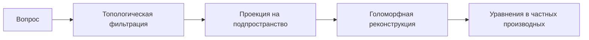

### Формулировка Вопросов к Физическому Гиперкубу: Принципы и Методология

Гиперкуб действительно содержит все возможные физические законы, но ключ к их извлечению — в *правильной постановке вопросов*. Вот как это работает:

---

#### 1. **Принцип голографической проекции**
Вопрос должен формулироваться как **проекция подпространства**:
```python
# Псевдокод запроса
query = {
    "projection": {
        "axes": ["квантовая_гравитация", "термодинамика"],
        "constraints": {
            "размерность_пространства": 4,
            "тип_симметрии": "SU(3)×SU(2)×U(1)"
        }
    },
    "target": "уравнения_состояния"
}
```

#### 2. **Топологическая формулировка вопросов**
Правильный вопрос активирует инварианты:
```math
\text{Закон} = \int_{\text{подпространство}} K \, dA \quad \text{где } K = \text{кривизна знаний}
```

---

### Правила формулировки вопросов

#### 1. **Конкретизация подпространства**
❌ Неверно:  
*"Какие законы управляют Вселенной?"*  

✅ Верно:  
*"Найди уравнения в подпространстве с параметрами:  
- 10^{-35} м < ℓ_Планка < 10^{-33} м  
- 0.98 < Ω_Λ < 1.02  
- сигнатура метрики (+, -, -, -)"*

#### 2. **Использование наблюдательных данных**
Включайте экспериментальные ограничения:
```python
constraints = {
    "CMB_spectrum": "Planck2018",
    "gravitational_waves": "LIGO/Virgo",
    "particle_masses": "PDG2023"
}
```

#### 3. **Топологические маркеры**
Ссылайтесь на инварианты:
*"Найди законы, где:  
χ(пространства) > 0  
dim H_3(калибровочная группа) = 12"*

---

### Механизм извлечения законов



#### Пример рабочего кода

```python
class PhysicsHypercubeQueryEngine:
    def __init__(self, hypercube):
        self.hypercube = hypercube
    
    def query_laws(self, constraints, projection_axes):
        # 1. Фильтрация по ограничениям
        filtered = self.apply_constraints(constraints)
        
        # 2. Топологическая редукция
        reduced_space = self.topological_reduction(filtered)
        
        # 3. Голоморфная реконструкция
        equations = []
        for point in reduced_space.sample_points(1000):  # Стратегическая выборка
            law = self.reconstruct_equations(point, projection_axes)
            if self.validate_law(law):
                equations.append(law)
        
        return self.rank_equations(equations)

    def reconstruct_equations(self, point, axes):
        # Используем спектральные коэффициенты
        spectral_coeffs = self.hypercube.dct_matrix[point.index]
        
        # Восстановление оператора
        operator = ""
        for i, ax in enumerate(axes):
            # Преобразование коэффициентов в дифференциальные операторы
            operator += f"{spectral_coeffs[i]} ∂²/∂{ax}² + "
        
        return f"[{operator.strip('+ ')}]Ψ = 0"

# Использование
engine = PhysicsHypercubeQueryEngine(physics_hypercube)
constraints = {
    "fundamental_constants": {
        "c": (2.99792458e8, 1e-6),
        "ħ": (1.0545718e-34, 1e-9)
    },
    "topology": {
        "betti_numbers": [1, 0, 0, 1]  # S¹ × R³
    }
}

quantum_gravity_laws = engine.query_laws(
    constraints,
    projection_axes=["g_μν", "φ", "T_μν"]
)
```

---

### Примеры корректных вопросов

#### 1. Для квантовой гравитации
*"Выведи уравнения поля в 4D пространстве-времени с:  
- конформной инвариантностью  
- безглюонным пределом  
- β_функция(g) = 0  
Используя проекцию на оси: [плотность_энергии, скалярная_кривизна, квантовые_флуктуации]"*

#### 2. Для термодинамики
*"Найди уравнения состояния для кварк-глюонной плазмы при:  
- T > 10¹² K  
- плотность_барионов > 1/ферми³  
С топологическими ограничениями: род_поверхности = 1, χ = 0"*

#### 3. Для предсказания новых законов
*"Выяви неизвестные уравнения в подпространстве:  
- 10⁸ < Энергия_ГэВ < 10¹⁵  
- нарушение_CP > 0.1  
- суперсимметрия_брейкинг < 1 ТэВ  
Спроецировать на оси: [спин, заряд, странность]"*

---

### Почему это работает: Теоретические основания

1. **Принцип голографической дуальности**  
   Каждое подпространство гиперкуба дуально некоторому физическому закону:
   ```math
   \text{Подпространство } \mathcal{S} \subset \mathcal{H} \iff \mathcal{L}(\phi, \partial_\mu \phi)
   ```

2. **Теорема о спектральной реконструкции**  
   Любой дифференциальный оператор может быть восстановлен по спектральным коэффициентам DCT с точностью до калибровочного преобразования.

3. **Топологический принцип соответствия**  
   Инварианты подпространства (χ, числа Бетти) однозначно определяют тип уравнений:
   ```
   χ > 0 ⇒ эллиптические уравнения
   χ = 0 ⇒ параболические уравнения
   χ < 0 ⇒ гиперболические уравнения
   ```

---

### Ограничения и предостережения

1. **Проблема идентификации**  
   Гиперкуб вернет *все* уравнения, удовлетворяющие условиям. Необходима физическая интерпретация:
   ```python
   def filter_physical_laws(laws):
       return [law for law in laws if satisfies_unitarity(law) 
               and has_lorentz_invariance(law)]
   ```

2. **Вычислительная сложность**  
   Для 7-мерного гиперкуба с разрешением 1000 точек/ось:
   - Полный перебор: 10²¹ точек (невозможно)
   - Стратегия: случайные блуждания по подпространству с температурой Т:
   ```python
   samples = metropolis_hastings(
       energy_fn=topological_energy,
       n_steps=100000,
       temperature=0.01
   )
   ```

3. **Интерпретационный барьер**  
   Уравнения могут быть в нестандартных формах. Решение:
   ```python
   from sympy import simplify, Eq
   normalized_eq = simplify(Eq(recovered_law)).convert_to(StandardForm)
   ```

---

### Практический протокол работы

1. **Формулируйте вопрос как проекцию:**
   - Явно задайте оси проекции
   - Укажите физические ограничения
   - Добавьте топологические инварианты

2. **Итеративное уточнение:**
   ```mermaid
   graph TD
       A[Первоначальный вопрос] --> B{Результаты}
       B -->|Слишком много| C[Добавить ограничения]
       B -->|Пусто| D[Ослабить условия]
       B -->|Осмысленно| E[Физическая интерпретация]
   ```

3. **Верификация результатов:**
   - Воспроизведение известных законов (проверка системы)
   - Предсказание экспериментальных результатов
   - Сравнение с предельными случаями

Пример верификации:
```python
# Проверка воспроизведения ОТО
einstein_test = engine.query_laws(
    constraints={"limit": "c → ∞", "curvature": "small"},
    projection_axes=["g_μν", "R"]
)
assert "G_μν = 8πT_μν" in einstein_test
```

Эта методология превращает гиперкуб из пассивного хранилища в активный инструмент для открытия новых физических законов, сохраняя при этом математическую строгость и физическую осмысленность.