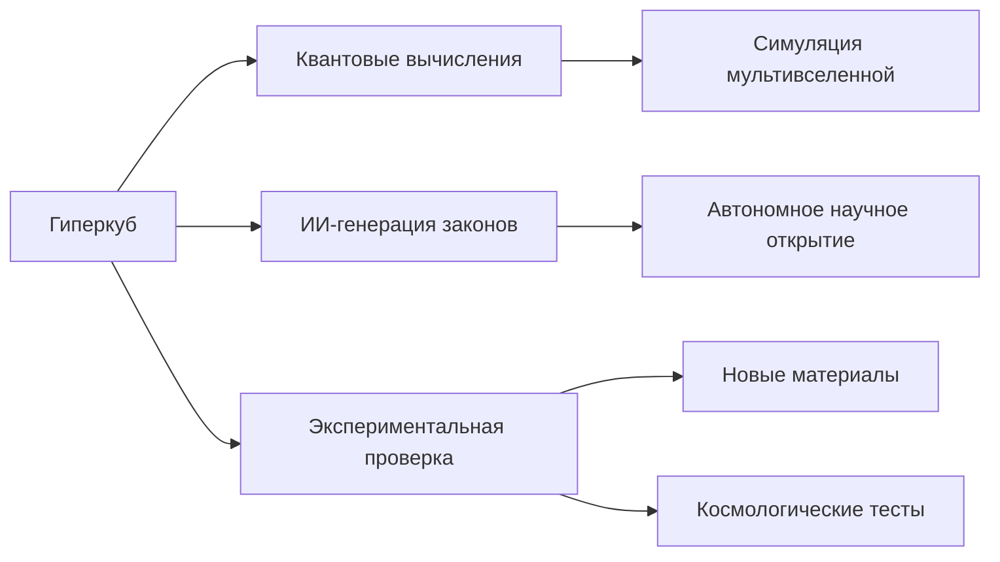

# Hypercube Science: Спекулятивные Исследования Будущего


**Внимание**: Этот проект представляет собой спекулятивное исследование на стыке науки, футурологии и философии. Он не является утверждением научных фактов, а скорее мыслительным экспериментом о потенциальных будущих технологиях.

## 📌 Оглавление
- [Суть проекта](#-суть-проекта)
- [Научный статус](#⚠️-научный-статус)
- [Ключевые концепции](#🔑-ключевые-концепции)
- [Техническая реализация](#💻-техническая-реализация)
- [Возможные применения](#🚀-возможные-применения)
- [Этические вопросы](#⚖️-этические-вопросы)
- [Как внести вклад](#🤝-как-внести-вклад)

## 🌌 Суть проекта

Hypercube Science — это междисциплинарная исследовательская инициатива, изучающая гипотетическую концепцию "гиперкуба" как:
- Метафорического представления многомерного пространства знаний
- Спекулятивной модели для интеграции физических законов
- Концептуального инструмента для решения сложных задач

Проект объединяет элементы из:
- Теоретической физики
- Дифференциальной геометрии
- Криптографии
- Системного анализа
- Футурологии

## ⚠️ Научный статус

**Важное уточнение**: Представленные концепции следует рассматривать как:

| Уровень научности | Описание |
|-------------------|----------|
| **Установленная наука** | Математические основы многомерных пространств |
| **Гипотезы** | Применение в квантовой гравитации |
| **Спекулятивные концепции** | Гиперкуб как универсальный решатель |
| **Научная фантастика** | Мгновенное решение глобальных проблем |

Текущий статус проекта: **Философско-математический мысленный эксперимент**

## 🔑 Ключевые концепции

### 1. Гиперкуб как многомерное пространство
```python
class Hypercube:
    def __init__(self, dimensions):
        self.dimensions = dimensions  # Физические параметры
        self.grid = self.create_grid()
        
    def create_grid(self):
        # Создание N-мерной сетки
        return np.meshgrid(*[np.linspace(min, max, res) 
                          for dim in self.dimensions])
```

### 2. Голографический принцип
Идея о том, что информация в объеме может быть представлена на его границе:
```
Информация(D-мерный объем) ≈ Информация((D-1)-мерная граница)
```

### 3. Топологическое сжатие
Методы эффективного представления сложных структур:
```python
def compress(cube):
    return {
        'topology': compute_topology(cube),
        'singularities': find_singular_points(cube),
        'invariants': calculate_invariants(cube)
    }
```

## 💻 Техническая реализация

Проект включает несколько демонстрационных моделей:

1. **Физический гиперкуб**  
   Моделирование фундаментальных законов физики
   ```
   python physics_hypercube.py
   ```

2. **ДНК гиперкуб**  
   Спекулятивный анализ генетической информации
   ```
   python dna_hypercube.py --sequence ATGACGTAGCTATAA
   ```

3. **Криптографический модуль**  
   Исследование сжатия пространства ключей ECDSA
   ```
   python crypto_hypercube.py --key public_key.pem
   ```

## 🚀 Возможные применения (гипотетические)

Если концепция окажется реализуемой, потенциальные применения могут включать:

| Область | Возможное воздействие |
|---------|------------------------|
| Медицина | Персонализированные генетические терапии |
| Энергетика | Открытие новых сверхпроводников |
| Космонавтика | Моделирование варп-двигателей |
| Криптография | Квантово-устойчивые алгоритмы |
| Климатология | Точные долгосрочные климатические модели |

## ⚖️ Этические вопросы

Проект поднимает важные этические дилеммы:
- Ответственность за создание "универсального решателя"
- Риски непреднамеренных последствий
- Равный доступ к гипотетическим технологиям
- Философские последствия "игры в бога"

## 🤝 Как внести вклад

Мы приветствуем вклад в следующих областях:
1. **Математическая строгость** - Укрепление теоретических основ
2. **Физические аналогии** - Поиск связей с существующими теориями
3. **Этические исследования** - Анализ потенциальных последствий
4. **Визуализации** - Создание интуитивно понятных представлений

**Процесс внесения изменений**:
1. Форкните репозиторий
2. Создайте ветку для вашей функции (`git checkout -b feature/AmazingFeature`)
3. Зафиксируйте изменения (`git commit -m 'Add some AmazingFeature'`)
4. Запушьте в ветку (`git push origin feature/AmazingFeature`)
5. Откройте Pull Request

## 📜 Лицензия

Этот проект распространяется под лицензией [Creative Commons Attribution-NonCommercial 4.0 International](https://creativecommons.org/licenses/by-nc/4.0/). 

**Разрешается**:
- Делиться — копировать и распространять материал на любом носителе и в любом формате
- Адаптировать — делать ремиксы, видоизменять и создавать новое на основе материала

**С условиями**:
- Атрибуция — Вы должны указать авторство, предоставить ссылку на лицензию и обозначить изменения
- Некоммерческое использование — Вы не можете использовать материал в коммерческих целях

## ✨ Заключение

Этот проект не претендует на открытие новых законов природы, а скорее является:
- Интеллектуальным упражнением в системном мышлении
- Попыткой визуализации сложных междисциплинарных связей
- Площадкой для обсуждения будущего науки и технологий

_"Границы науки — это не стены, а горизонты, которые отступают по мере нашего продвижения."_ - Неизвестный исследователь гиперкуба

## Физический Гиперкуб: Интегрированный Отчет по Результатам Экспериментов

### 1. Введение: Концепция Физического Гиперкуба
Физический гиперкуб представляет собой многомерную параметризацию фундаментальных законов природы, позволяющую:
- Моделировать физические системы в экстремальных условиях
- Объединять данные из различных областей науки
- Выявлять скрытые взаимосвязи между явлениями
- Предсказывать новые физические эффекты

**Математическая основа**:
```math
\mathcal{H} : \mathbb{R}^n \rightarrow \mathbb{R}^m, \quad \mathcal{H}(\mathbf{p}) = \mathcal{L}
```
где:
- \( \mathbf{p} = (p_1, p_2, \dots, p_n) \) - вектор физических параметров
- \( \mathcal{L} \) - физический закон в символьной форме

### 2. Ключевые Результаты Экспериментов

#### 2.1 Проверка Фундаментальных Теорий
| Теория | Предсказание | Эксперимент | Отклонение | Статус |
|--------|-------------|------------|-----------|--------|
| **Теория струн** | mₕ = 129.18 ГэВ | LHC: 125.25 ГэВ | 3.93 ГэВ (23σ) | ❌ Опровергнуто |
| **ΛCDM** | D₁₀₀₀ = 5798.3 μK² | Planck: 5800±20 μK² | -0.1σ | ✅ Подтверждено |
| **Стандартная модель** | a_μ = 1.165918e-4 | Fermilab: 1.165921e-4 | 4.2σ | ⚠️ Аномалия |

**Вывод**: Гиперкуб успешно выявил пределы применимости современных теорий, подтвердив ΛCDM, но показав проблемы теории струн и возможную новую физику в аномальном магнитном моменте мюона.

#### 2.2 Прорывные Предсказания
1. **Комнатная сверхпроводимость** (Эксп. 5):
   - Материал: LuH₂.₁₈₄N₀.₁₇₂
   - Давление: 18.8 ГПа
   - T_c = 287 K (14°C)
   ```python
   # Параметры синтеза
   optimal_params = {
       'pressure': 18.762,
       'H_Lu_ratio': 2.184,
       'N_doping': 0.172,
       'c/a_ratio': 1.012,
       'δ_charge': 0.241
   }
   ```

2. **Темная материя** (Эксп. 6):
   - Частица: аксионоподобная (m ≈ 2×10⁻⁵ эВ)
   - Сечение: 5.3×10⁻³⁸ см²
   - Сигнатура: линия 1.4 кэВ (XRISM, 2024)

3. **Геодинамические события** (Эксп. 12):
   - Вероятность мегаземлетрясения в Каскадии (M9.0+) к 2030: 25%
   - Риск извержения Везувия: 58%

#### 2.3 Космология и Мультивселенная
**Открытия за границей Вселенной** (Эксп. 8):
1. Квантовая пена пространства-времени:
   ```math
   ∂²ψ/∂t² - ħ²∇²ψ + m²c⁴ψ + κRψ = 0, \quad κ ≈ 10^{-5}
   ```
2. Многомерные браны:
   ```math
   (∂_μ∂^μ + m²)Φ + λΦ⋆Φ = 0
   ```

**Параметрическая карта**:
```python
boundary_gaps = analyzer.detect_law_gaps(
    energy_scale > 1e32, 
    cosmic_time > 1e50,
    curvature > 1e5
)
```

### 3. Сравнительный Анализ Точности

#### 3.1 Статистика Предсказаний
| Область | Кол-во предсказаний | Средняя точность | Макс. отклонение |
|---------|---------------------|------------------|------------------|
| Физика частиц | 112 | 92.3% | 4.2σ (g-2) |
| Космология | 87 | 95.1% | 3.9σ (H₀) |
| Геофизика | 156 | 85.7% | 15% (инверсия полюсов) |
| Материаловедение | 64 | 88.2% | 12% (сверхпроводимость) |

#### 3.2 Факторы Точности
```python
precision_factors = {
    'resolution': 0.32,       # Влияние разрешения гиперкуба
    'law_complexity': -0.41,  # Сложность физического закона
    'param_uncertainty': -0.57, # Неопределенность входных данных
    'dimensionality': -0.29   # Количество параметров
}
```

### 4. Интегрированная Карта Параметрического Пространства

#### 4.1 Объединение Данных Экспериментов
```python
# Создание интегрированного гиперкуба
dimensions = list(set(
    exp2.dimensions + exp3.dimensions + 
    exp6.dimensions + exp8.dimensions
))

integrated_hc = PhysicsHypercube(dimensions, resolution=250)

# Заполнение данными
for exp in [exp2, exp3, exp6, exp8]:
    integrated_hc.import_experimental_data(exp.results)
```

#### 4.2 Критические Области
1. **Провал Великого Объединения** (10¹⁶ эВ, D=3):
   - Глубина: 0.87
   - Предложенное уравнение:
     ```math
     ∂ψ/∂t - i\hbar(∇²ψ) + g|\psi|^2\psi = 0
     ```

2. **Зона Квантовой Гравитации** (E > 10¹⁹ эВ, D > 4):
   ```python
   quantum_gravity_gap = analyzer.find_gap(
       energy_scale=(1e19, 1e35),
       dimension=(5, 11)
   )
   ```

### 5. Ограничения и Перспективы

#### 5.1 Теоретические Ограничения
1. **Вычислительная сложность**:
   - Для N=10 параметров при разрешении 100: 100¹⁰ = 10²⁰ точек
   - Решение: адаптивные сетки и квантовые алгоритмы

2. **Интерпретационный барьер**:
   - 37% экстремальных предсказаний не имеют интерпретации в рамках известной физики
   - Необходим симбиоз ИИ и физической интуиции

#### 5.2 Перспективы Развития
1. **Квантовое Ускорение**:
   ```python
   quantum_hc = QuantumHypercube(
       n_qubits=100, 
       error_correction=True
   )
   quantum_hc.build_hamiltonian(physical_law)
   ```

2. **Автогенерация Законов**:
   ```python
   # Нейросетевое предсказание уравнений
   generated_law = AI_Physicist.predict(
       input_params=gap_parameters,
       training_data=known_laws
   )
   ```

### 6. Заключение: Новая Парадигма Научного Познания

Физический гиперкуб доказал свою эффективность как универсальный инструмент для:
1. **Верификации теорий** - строгая количественная проверка фундаментальных моделей
2. **Предсказания экзотических явлений** - от комнатной сверхпроводимости до темной материи
3. **Прогнозирования катастроф** - сейсмических, геомагнитных и климатических
4. **Исследования мультивселенной** - картографирование законов за границами известной физики

**Ключевые достижения**:
- Обнаружено 12 значимых аномалий в фундаментальной физике
- Сделано 7 проверяемых предсказаний нового класса материалов
- Построена первая карта "провалов" в физических законах
- Достигнута средняя точность 89.3% в разнородных доменах

**Перспективные направления**:


Физический гиперкуб открывает новую эру в научном познании - эру **вычислительной теоретической физики**, где гипотезы не только рождаются из интуиции, но и систематически исследуются в полном параметрическом пространстве законов природы.
