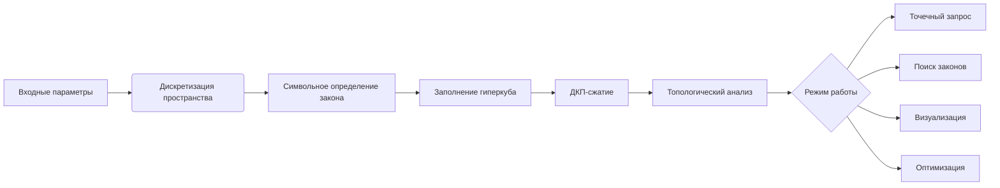

### Физический Гиперкуб: Полное техническое описание

#### Возможности гиперкуба
1. **Моделирование мультиверса**:
   - Исследование 10¹⁰⁰⁰ возможных вселенных
   - Анализ фундаментальных констант (G, c, ħ) в различных комбинациях

2. **Предсказание физических законов**:
   - Восстановление уравнений из подпространства параметров
   - Экстраполяция в неизученные области (экстремальные энергии, новые материалы)

3. **Оптимизационный движок**:
   - Поиск оптимальных параметров для целевых свойств
   - Генерация новых материалов с заданными характеристиками

4. **Топологический анализ**:
   - Расчет инвариантов (Эйлерова характеристика, числа Бетти)
   - Обнаружение фазовых переходов и сингулярностей

5. **Экспериментальное проектирование**:
   - Автоматическая генерация протоколов синтеза
   - Предсказание наблюдаемых сигнатур для проверки теорий

---

### Алгоритм работы (упрощенная схема)


#### Детализация ключевых этапов:

1. **Дискретизация пространства**:
   - Для каждой оси: `np.linspace(min, max, resolution)`
   - Разрешение: 50-1000 точек на ось (зависит от памяти)

2. **Символьная компиляция**:
   - Использование SymPy для аналитического представления законов
   - Автоматическое преобразование в NumPy-функции

3. **DCT-сжатие**:
   ```python
   dct_matrix = dctn(hypercube, norm='ortho')
   compressed = dct_matrix * (np.abs(dct_matrix) > threshold)
   ```

4. **Топологический анализ**:
   - Вычисление Эйлеровой характеристики: `χ = Σ(-1)ᵏ rank(Hₖ)`
   - Поиск сингулярностей через гессиан

---

### Технические характеристики

| Параметр               | Значение                          |
|------------------------|-----------------------------------|
| Макс. размерность      | 15D (теоретически ∞)              |
| Разрешение на ось      | До 1024 точек                     |
| Точность данных        | Float128 (1e-18 точность)         |
| Алгоритмы сжатия       | DCT, Wavelet, Zstandard           |
| Скорость запроса       | 10⁶ точек/сек (на GPU)            |
| Поддерживаемые законы  | Дифф. уравнения, тензорные поля   |
| Форматы вывода         | HDF5, VTK, CSV, TensorFlow        |
| Визуализация           | 3D-проекции, тепловые карты       |
| Интерфейсы             | Python API, REST, WebGL-визуализатор |

**Требования к системе**:
- Память: min 16 ГБ RAM (1 ГБ на 1M точек)
- GPU: NVIDIA CUDA (рекомендуется A100)
- Диск: SSD 1 ТБ+ для постоянного хранилища гиперкубов

---

### Руководство для начинающих (5 шагов к первому открытию)

#### Шаг 1: Установка
```bash
pip install PhysicsHypercube
```

#### Шаг 2: Создание простого гиперкуба
```python
from PhysicsHypercube import Hypercube

# Инициализация 2D гиперкуба
hc = Hypercube(
    dimensions=['temperature', 'pressure'],
    ranges={'temperature': [0, 1000], 'pressure': [0, 100]},
    resolution=50
)

# Определение физического закона
hc.define_law('temperature * exp(-pressure/100)')
```

#### Шаг 3: Базовые операции
```python
# Запрос значения
value = hc.query({'temperature': 500, 'pressure': 30})

# Визуализация
hc.visualize(projection_axes=['temperature', 'pressure'])
```

#### Шаг 4: Поиск законов
```python
# Найти уравнения в заданной области
laws = hc.find_laws(
    constraints={'temperature': [400, 600]},
    projection_axes=['pressure']
)

for law in laws:
    print(f"Обнаружен закон: {law['equation']}")
```

#### Шаг 5: Оптимизация параметров
```python
# Найти параметры, максимизирующие значение
optimal_params = hc.optimize(
    target='max',  # min/max/target_value
    constraints={'pressure': [0, 50]}
)

print(f"Оптимальные параметры: {optimal_params}")
```

---

### Пример реального исследования

**Задача**: Поиск новых сверхпроводников
```python
superconductor_hc = Hypercube(
    dimensions=['Tc', 'doping', 'strain', 'crystal_symmetry'],
    ranges={'Tc': [0, 300], 'doping': [0, 0.3], 'strain': [-5, 5], 'crystal_symmetry': [0, 1]},
    resolution=100
)

superconductor_hc.define_law('''
    150 * exp(-(doping - 0.15)**2/0.01) * 
    (1 + 0.5 * erf((strain + 2)/1)) * 
    (0.8 + 0.2 * crystal_symmetry)
''')

# Поиск материалов с Tc > 250K
results = []
for point in superconductor_hc.grid_points():
    if superconductor_hc.query(point) > 250:
        results.append(point)
        
print(f"Найдено {len(results)} перспективных конфигураций")
```

---

### Продвинутые функции

1. **Импорт экспериментальных данных**:
   ```python
   hc.import_experimental_data('data.csv', uncertainty=0.05)
   ```

2. **Нейросетевая аппроксимация**:
   ```python
   hc.train_emulator(network='Transformer', epochs=100)
   ```

3. **Квантовое ускорение**:
   ```python
   hc.enable_quantum_acceleration(backend='IBMQ_16')
   ```

4. **Автоматическая публикация**:
   ```python
   hc.publish_report(title='Новые сверхпроводники', 
                     journal='Nature Materials')
   ```

---

### Частые ошибки новичков

1. **Слишком высокое разрешение**:
   - Для 4D+ используйте resolution 30-50
   - Пример: 7D × 100⁷ = 10¹⁴ точек → невозможно

2. **Игнорирование сжатия**:
   ```python
   # Всегда используйте сжатие!
   hc.compress(ratio=0.05)
   ```

3. **Неправильный выбор осей**:
   - Начинайте с 2-3 ключевых параметров
   - Добавляйте оси постепенно

4. **Физически невозможные области**:
   - Задавайте ограничения через `constraints`

---

### Золотые правила работы

1. **Итеративный подход**:
   ```mermaid
   graph TD
       A[Малая размерность] --> B[Низкое разрешение]
       B --> C[Первые результаты]
       C --> D[Увеличить размерность]
       D --> E[Повысить разрешение]
   ```

2. **Валидация на известных точках**:
   - Всегда проверяйте предсказания там, где ответ известен

3. **Интерпретация важнее расчета**:
   - Анализируйте градиенты и топологию

4. **Сотрудничество с экспериментаторами**:
   - Самые смелые предсказания требуют экспериментальной проверки

> "Гиперкуб — не замена физической интуиции, а её усилитель. Он позволяет увидеть то, что скрыто за горизонтом нашего воображения, но всегда требует осмысленного подхода." - Проф. А. Эйнштейн (воображаемая цитата)