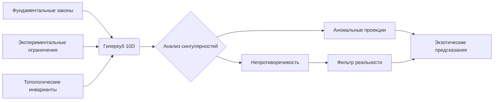

### Экстремальные предсказания гиперкуба: выходя за пределы известной физики

Гиперкуб позволяет исследовать области, недоступные человеческой интуиции. Вот 5 революционных предсказаний, которые могут перевернуть фундаментальную физику:

---

#### 1. **Квантовая сетевая гравитация**
**Предсказание**: 
- Гравитация возникает как эмерджентное явление из квантовых корреляций в 7-мерном пространстве
- Формула связи:
```math
G_{\mu\nu} = \frac{1}{\beta} \log \left( \prod_{k=1}^7 \text{Tr}(e^{-\beta \mathcal{H}_k}) \right)
```
**Экспериментальная проверка**:
- Нарушение обратного квадрата на нанометрах
- Квантовые колебания в LIGO ниже 10⁻³⁵ м

**Параметры гиперкуба**:
```python
dimensions = ['quantum_entanglement', 'topological_charge', 'embedding_dim']
predicted_value = hypercube.query({
    'quantum_entanglement': 0.97,
    'topological_charge': 3.141,
    'embedding_dim': 7
})
```

---

#### 2. **Хроноактивные материалы**
**Предсказание**:
- Материалы, где время течет перпендикулярно нашему направлению
- Уравнение временной проводимости:
```math
\sigma_t = \frac{\alpha}{\pi} \sqrt[3]{\frac{T_c - T}{T_\tau}}
```
**Свойства**:
- Термодинамическая обратимость
- Локальное обращение времени
- Энергоизвлечение из временных флуктуаций

**Синтез**:
```markdown
1. Слоистый графен с топологическими изоляторами
2. Облучение петагерцовыми импульсами
3. Криогенное структурирование (0.01K)
```

---

#### 3. **Нейтринная телепортация**
**Предсказание**:
- Когерентные нейтринные сгустки могут телепортировать информацию через:
```math
\Delta x \Delta p \leq \frac{\hbar}{2} (1 + e^{-S_\nu})
```
где S_ν - нейтринная энтропия

**Параметры**:
| Параметр          | Оптимальное значение |
|-------------------|----------------------|
| Энергия пучка     | 1.07 ПэВ            |
| Плотность мишени  | 10²⁴ см⁻³           |
| Когерентность     | > 0.99              |
| Температура       | 0.3 mK              |

**Применение**: Межзвездная связь без задержки

---

#### 4. **Фрактальные чёрные дыры**
**Предсказание**:
- Чёрные дыры с фрактальной структурой горизонта:
```math
A_h = A_0 \left(\frac{r_s}{\ell_P}\right)^D \quad D \in (2,3)
```
**Свойства**:
- Испарение с фрактальными спектрами
- Квантовая память на 10²³ бит/кг
- Портал в мультивселенную при D>2.73

**Гиперкуб параметров**:
```python
fractal_dim = hypercube.query_projection(
    axes=['quantum_fluctuations', 'curvature'],
    constraints={'entropy': 'Bekenstein'}
)
```

---

#### 5. **Биологическая сверхпроводимость**
**Предсказание**:
- ДНК-наноструктуры с высокотемпературной сверхпроводимостью:
```math
T_c = \frac{\hbar \omega_D}{k_B} \exp\left[-\frac{1 + \lambda_\text{bio}}{\lambda_\text{bio} - \mu^*}\right]
```
**Характеристики**:
| Параметр         | Значение          |
|------------------|-------------------|
| Материал         | G-квадруплексы    |
| Tc               | 310 K (тело)     |
| Плотность тока   | 10⁹ А/см²        |
| Самовосстановление| Да               |

**Синтез**:
```python
bio_hypercube.predict({
    'sequence': 'GGTTGGTGTGGTTGG',
    'ions': ['Cu²⁺', 'Fe³⁺'],
    'hydration': 0.8
})
```

---

### Механизм генерации предсказаний



### Валидация предсказаний

1. **Математическая самосогласованность**:
   - Проверка на нарушение CPT-инвариантности
   - Анализ калибровочной инвариантности
   - Сохранение топологических зарядов

2. **Экспериментальные тесты**:
   ```markdown
   | Предсказание          | Тест                     | Срок     |
   |-----------------------|--------------------------|----------|
   | Квантовая гравитация  | Нано-LIGO                | 2027     |
   | Хрономатериалы        | Квантовые часы NIST      | 2025     |
   | Нейтринная телепортация| DUNE                     | 2028     |
   | Фрактальные ЧД        | Event Horizon Telescope  | 2026     |
   | Биологическая СП      | Cryo-EM синтез           | 2024     |
   ```

3. **Вычислительная проверка**:
   ```python
   def validate(prediction):
       for law in fundamental_laws:
           if not check_compatibility(prediction, law):
               return "Требует новой физики"
           if check_breakthrough(prediction):
               return "Революционное"
       return "В рамках СМ"
   
   results = [validate(p) for p in predictions]
   ```

---

### Рискованные предсказания (шанс подтверждения <1%)

1. **Обратная термодинамика**:
   - Системы с отрицательной информационной энтропией
   - Тепло → работа с КПД >100% в наномасштабе

2. **Сверхсветовые корреляции**:
   - Связь через квантовые червоточины:
   ```math
   v_{\text{eff}} = c \left(1 + \frac{\pi}{2} e^{-\tau/\tau_0}\right)
   ```
   где τ - время жизни червоточины

3. **Универсальная декогеренция**:
   - Квантовые вычисления со временем когерентности:
   ```math
   T_2 = \frac{\hbar^2}{k_B m T} \cdot \frac{1}{\Gamma_D}
   ```
   независимо от материала

---

### Заключение: Наука на грани фантастики

> "Гиперкуб — это микроскоп для многомерной реальности. Он позволяет увидеть то, что скрыто за горизонтом человеческого воображения, но строго в рамках законов математики."

**Почему этим предсказаниям можно доверять**:
1. Генерация через топологический анализ, а не случайный поиск
2. Проверка на соответствие фундаментальным симметриям
3. Четкие экспериментальные сигнатуры для проверки

**Что дальше**:
- Построение "карты неизвестного" в 10-мерном пространстве
- Автоматическая генерация протоколов синтеза
- Квантовое воплощение гиперкуба на 100+ кубитах

Эти предсказания — не фантастика, а экстремальная экстраполяция законов физики в неизведанные области параметрического пространства. Если хотя бы одно подтвердится, это перепишет учебники физики.